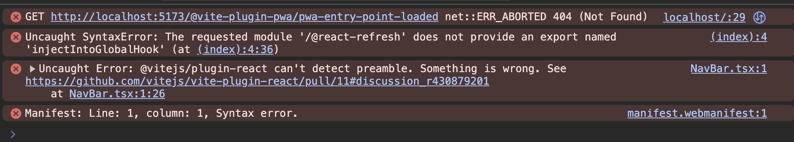

# Vite + React: "Uncaught Error: @vitejs/plugin-react can't detect preamble. Something is wrong."

## Getting started

Reproduce this by running:

```
  pnpm install
  pnpm dev
```

So far, reproducible in Chrome.

## Error detail

> Home.tsx:1 Uncaught Error: @vitejs/plugin-react can't detect preamble. Something is wrong.

This is the error that's seen, so far only in Chrome (latest). Clicking on `Shift` + Refresh causes it to "work", until the next refresh.


This stems from the `Home` component, which I've made an empty functional React component


Possible info:

- https://github.com/vitejs/vite-plugin-react/pull/79

### Other issues

- `http://localhost:5173/@vite-plugin-pwa/pwa-entry-point-loaded net::ERR_ABORTED 404 (Not Found)` - where does this come from?
- `Uncaught SyntaxError: The requested module '/@react-refresh' does not provide an export named 'injectIntoGlobalHook' (at (index):4:36)` - is this injected by React?

## Feedback

Please open an issue and I'd appreciate any feedback possible.

Thanks!
